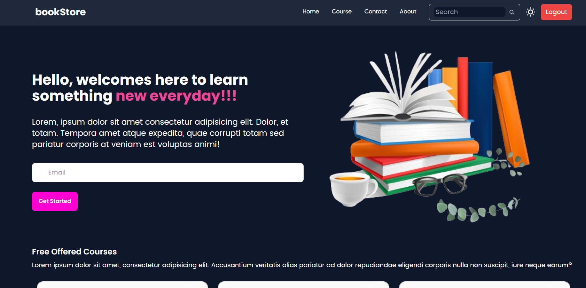

# BookStore App

Welcome to the BookStore App, an online platform designed to help you learn something new every day! Explore a variety of courses and enhance your skills with our user-friendly interface.

## Table of Contents

- [Features](#features)
- [Technologies Used](#technologies-used)
- [Installation](#installation)
- [Screenshots](#screenshots)
- [Dependencies](#Dependencies)
- [FrontendSetup](#FrontendSetup)
- [Scripts](#Scripts)
- [Dependenciess](#Dependenciess)
- [DevelopmentDependencies](#DevelopmentDependencies)


## Features

- **User-Friendly Navigation**: A responsive Navbar for easy access to different sections.
- **Course Listings**: A dedicated section to explore free and offered courses.
- **Informative Content**: Details about the platform and company background.
- **Footer Section**: Essential links including About Us, Contact, and Jobs.
- **Responsive Design**: Mobile-friendly interface that works on all devices.

## Technologies Used

- **React**: JavaScript library for building user interfaces.
- **React Router**: For handling navigation between different views.
- **CSS**: For styling components and layouts.
- **Node.js**: Backend server environment (if applicable).
- **Express**: Web framework for Node.js (if applicable).
- **MongoDB**: NoSQL database for storing user and course data (if applicable).

## Installation

To get started with the BookStore App, follow these steps:

1. Clone the repository:

   ```bash
   git clone https://github.com/naivedya-13/bookStoreApp-master

2. cd bookStoreApp

3. cd Backend 

4. npm install

5. cd ..

6. cd Frontend

7. npm install

## Screenshots


## Dependencies

The following packages are used in this project:

- **`bcryptjs`**: ^2.4.3 - For hashing passwords securely.
- **`cors`**: ^2.8.5 - Middleware for handling CORS.
- **`dotenv`**: ^16.4.5 - Loads environment variables from a `.env` file.
- **`express`**: ^4.18.3 - Web framework for building the API.
- **`mongoose`**: ^8.2.2 - ODM for MongoDB, used for data modeling.
- **`nodemon`**: ^3.1.0 - Automatically restarts the server on file changes during development.

To install these dependencies, run:


## FrontendSetup

This project uses Vite as the build tool and React as the frontend framework.

## Scripts

The following scripts are available:

- **`dev`**: Start the development server.
- **`build`**: Build the application for production.
- **`lint`**: Run ESLint to check for code quality issues.
- **`preview`**: Preview the production build locally.

## Dependenciess

The project relies on the following packages:

- **`axios`**: For making API requests.
- **`react`**: The core library for building user interfaces.
- **`react-dom`**: For DOM-specific methods.
- **`react-hook-form`**: For managing forms.
- **`react-hot-toast`**: For toast notifications.
- **`react-router-dom`**: For routing capabilities.
- **`react-slick`**: For creating carousels.
- **`slick-carousel`**: The underlying carousel library.

## DevelopmentDependencies

The following packages are used for development purposes:

- **`@types/react`**: Type definitions for React.
- **`@vitejs/plugin-react`**: Vite plugin for React.
- **`daisyui`**: Pre-designed components for Tailwind CSS.
- **`eslint`**: For code linting and style checks.
- **`tailwindcss`**: Utility-first CSS framework.


